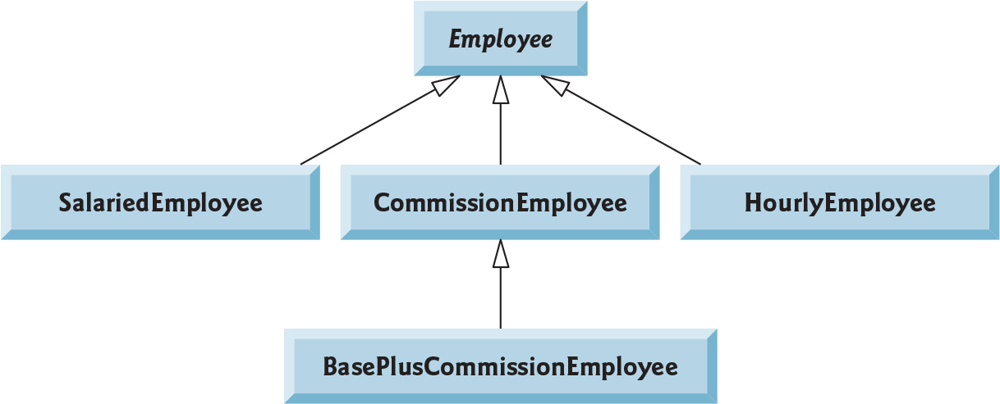

# Employee Management System

This project demonstrates the implementation of an **Employee Management System** using Java. The system uses an object-oriented approach to represent a class hierarchy of different employee types. The classes implement specific earnings calculation logic based on the type of employee (salaried, hourly, commission-based, or a combination).

---

## **Problem Specifications**

The goal is to create a program that:

1. Defines a generic, abstract `Employee` class with basic details and an abstract `earnings()` method.
2. Implements multiple employee types as subclasses:
   - `SalariedEmployee`: Paid a fixed weekly salary.
   - `HourlyEmployee`: Paid based on hours worked, with overtime pay for hours over 40.
   - `CommissionEmployee`: Paid based on a percentage of their gross sales.
   - `BasePlusCommissionEmployee`: Inherits from `CommissionEmployee` and includes a fixed base salary.
3. Ensures validation for inputs like hourly wage, hours worked, gross sales, and commission rate.
4. Uses polymorphism to process different employee types through a common interface.

---

## **Class Hierarchy**

Below is the class hierarchy for the system:



1. **`Employee`**:
   - Abstract class with common attributes: first name, last name, and social security number.
   - Abstract method `earnings()` to calculate employee-specific earnings.

2. **`SalariedEmployee`**:
   - Represents employees paid a fixed weekly salary.
   - Implements the `earnings()` method to return the weekly salary.

3. **`HourlyEmployee`**:
   - Represents employees paid an hourly wage.
   - Calculates earnings based on hours worked, with overtime for hours > 40.

4. **`CommissionEmployee`**:
   - Represents employees paid based on a percentage of gross sales.
   - Implements `earnings()` to calculate commission-based pay.

5. **`BasePlusCommissionEmployee`**:
   - Extends `CommissionEmployee` to add a fixed base salary.
   - Overrides `earnings()` to include base salary in the total earnings.

---

## **Program Output**

The following is the output of the `EmployeeTest.java` program, which demonstrates the functionality of the Employee hierarchy:

```java
Salaried employee: John Doe
Social security number: 111-11-1111
Weekly salary: 800.00
Earned: $800.00

Hourly employee: Jane Smith
Social security number: 222-22-2222
Hourly wage: 16.75; hours worked: 42.00
Earned: $720.25

Commission employee: Jack Johnson
Social security number: 333-33-3333
Sross sales: 10000.00; commission rate: 0.06
Earned: $600.00

Base salaried commission employee: Jill Brown
Social security number: 444-44-4444
Gross sales: 5000.00; commission rate: 0.04
Base salary: 300.00
Earned: $500.00
```